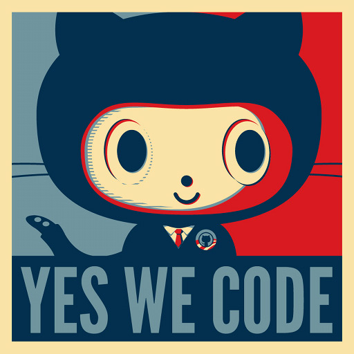
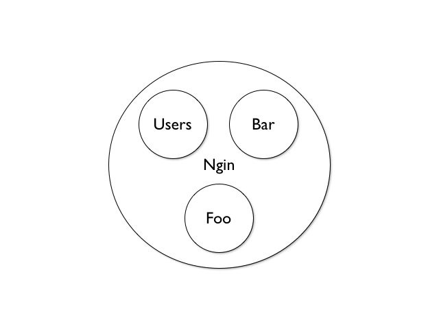
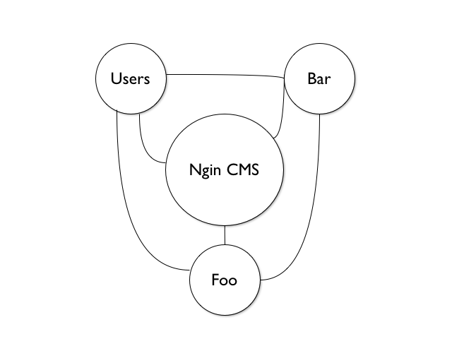

!SLIDE center

# Users, SOA tools & You

By Jon Phenow

!SLIDE

# Hi, I'm Jon Phenow

* I'm 22
* I like: beer, hacking long walks on the beach
* One year at Sport Ngin

http://github.com/jphenow

[@jphenow](http://twiter.com/jphenow)

http://jphenow.github.com

!SLIDE

!SLIDE bullets

# Current Projects

* [User Service](http://github.com/tstmedia/user_service)
* User tools ([Elmer](http://github.com/tstmedia/elmer))
* Inter-service tools ([Foundation](http://github.com/tstmedia/foundation))

!SLIDE

# Ngin now

!SLIDE

# Why are we talking?

## The future of the ecosystem

!SLIDE bullets

# Why do you care?

## SOA is cool and you can't escape it.

!SLIDE

# Why do you care?

* Focused Apps that do one thing well
* Consistency across services
* Convention over configuration
  - Write less, get more
  - Sort of
