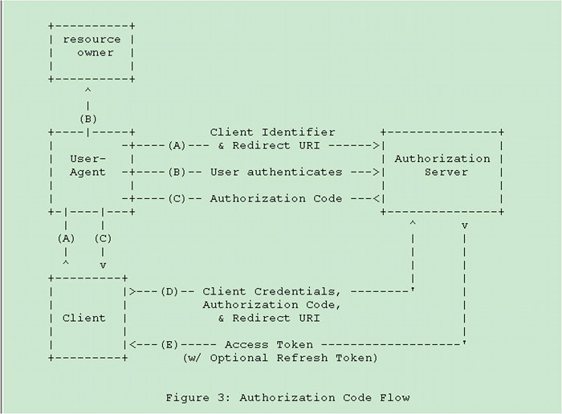
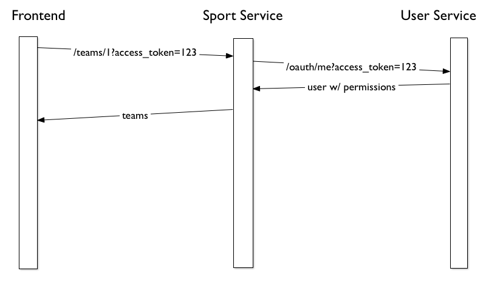

!SLIDE
# Foundation

  * Naming sucks
  * So does consistency

!SLIDE
# Foundation

* Common API payloads
* Common controller helpers for building payloads
  - errors
  - metadata
  - result

!SLIDE
# Foundation
## Common payloads between APIs

```js
{
  "metadata": {..},
  "result": {..},
  "error": { "status": "..", "messages": [..] }
}
```

!SLIDE
# Foundation
## Base Class

```ruby
class ApplicationController < Foundation::BaseController
end
```

!SLIDE
# Foundation
## Controller helpers

```ruby
def show
  metadata[:current_user] = current_user
  rescue_error status: :not_found, message: "Error!"
end
```

```js
{
  "metadata": {
    "current_user": {..}
  },
  "result": nil,
  "error": {
    "status": 404,
    "messages": "Error!"
  }
}
```
.notes suppress response codes, full object support

!SLIDE
# Foundation
## Controller helpers

```ruby
def update
  query_params        # => {}
  post_params         # => { :user => { id: => '1' } }
  object_params       # => { :id => '1' }
  render_action :show
end
```

```js
{
  "metadata": {..},
  "result": {..}
}
```

!SLIDE
# Foundation
## Controller helpers

```ruby
post_params         # => { :user => { id: => '1' } }
object_params       # => { :id => '1' }
```

```ruby
post_params         # => { :id => '1' }
object_params       # => { :id => '1' }
```

!SLIDE
# Foundation

  * Auto resource location
  * Base class for remote objects
  * Open up payload envelope
  * Querying (active dev)

!SLIDE
# Foundation
## Configuration

```ruby
Foundation.config do |config|
  config.set_proxy_url "http://api.ngin.com"
end

class User < Foundation::ServiceResource::Base
  field :first_name

  request_uri # => "http://user-service.ngin.com/users"

  path "something_else"
  request_uri # => "http://user-service.ngin.com/something_else"

  site "http://localhost:3000"
  request_uri # => "http://localhost:3000/something_else"
end
```
.notes change environments

!SLIDE
# Foundation
## Model

```ruby
User.all
User.where(..)        # => query params

user = User.new metadata: { current_user: {} }, result: { id: 1 }
user.id               # => 1
user.metadata         # => Metadata
user.remote_errors    # => Errors
user.name = "jon"
user.save
```
.notes caching, lazy loading, object like arel

!SLIDE
# User Service

  * User Auth
  * User specific data
  * current_user for future apps

!SLIDE
# User Service


http://oauth.net/2/

!SLIDE
# User Service
## Permissions, Groups & Roles

  Flat


!SLIDE
# User Service
## Groups

  * Owner
  * Many Personas
  * Dictates membership

!SLIDE
# User Service
## Roles

  * Accessed via name (No IDs)
  * Specific resources
  * read/write/admin
  * Can permission an object?
  * No knowledge of cascading objects

!SLIDE
# User Service
## Permissions


!SLIDE
# User Service
## Permissions

  * Principal (Persona/Group)
  * Resource  (Thing that requires access control)
  * Role      (For Permissions)

!SLIDE
# User Service
## Permissions

  * Client-side interpretation (not a browser)
  * Services => Elmer (we'll get there)
  * Clients => 401s

!SLIDE
# Elmer
## Not a gem for rabbit hunters


!SLIDE
# Elmer
## Glue


!SLIDE
# Elmer


!SLIDE
# Elmer

  * Built on Foundation
  * OAuth2 Redirect
  * Access Token passing

!SLIDE
# Elmer
## OAuth2 Redirect



!SLIDE
# Elmer
# Token Passing



!SLIDE
# Elmer
```ruby
Elmer.config do |config|
  config.client_id = "f26a66b69ddd4bd1ad6814f873e1468d"
  config.client_secret = "7e3295548bcdb7108eea63cd9371df75"

  config.ngin_token_grant_type = true
  config.ngin_passthrough = true

  config.foundation do |c|
    c.set_proxy_url "http://api.ngin.com"
  end
end
```

!SLIDE
# Elmer

  * Permission checks
  * DSL for defining cascading

!SLIDE
# Elmer
Let's say we have a permission:

```js
[{
  "resource_type": "Persona",
  "resource_id": 1,
  "principal_type": "League",
  "principal_id": 1,
  "role": "tournament_admin"
}]
```

Let's say tournament admin grants direct write access to League

!SLIDE
# Elmer
## Basic Permissions

```ruby
current_user.read? League.find(1)   # => true
current_user.write? League.find(1)  # => true
current_user.admin? League.find(1)  # => true
current_user.third_north?           # => false
```

!SLIDE
# Elmer
## Advanced Permissions

Let's say we still have:

```js
[{
  "resource_type": "Persona",
  "resource_id": 1,
  "principal_type": "League",
  "principal_id": 1,
  "role": "tournament_admin"
}]
```

!SLIDE
# Elmer
## Advanced Permissions

```ruby
class Game
  include Elmer::Permissionable
  permissioned_to :subseason, :leagues

  belongs_to :subseson

  def league
    League.find(1,2)
  end
end
```

!SLIDE
# Elmer
## Advanced Permissions

```ruby
current_user.can_read? Game.find(1)   # => true
current_user.can_write? Game.find(1)  # => true
current_user.can_admin? Game.find(1)  # => true
```
